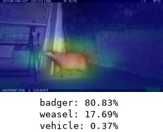
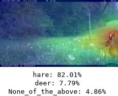
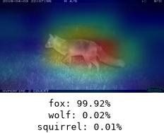

# Camera-traps-wild-life

[](https://github.com/pietro-foini/camera-traps-wild-life/actions)
[](https://github.com/pietro-foini/camera-traps-wild-life/releases)


Hello there! 😀

This project was born from the idea of applying such algorithms to camera traps located on my family’s property in a 
remote area of Italy, where wildlife is frequently observed. The goal was to develop a simple application for fixed 
camera trap systems, where a basic motion detection algorithm could automatically identify subjects to be analyzed 
by a fine-tuned machine learning model for image classification.

Example of results applied to generic camera traps (used only for inference purposes):

<video src="assets/badger_fixed.mp4" width="100%" controls muted autoplay loop></video>

<table width="100%" align="center">
  <tr>
    <td align="center" width="33%">
      <b>Badgers</b><br>
      <video src="assets/squirrel_bird.mp4" width="100%" controls muted autoplay loop></video>
    </td>
    <td align="center" width="33%">
      <b>Squirrel & Bird</b><br>
      <video src="assets/squirrel_bird.mp4" width="100%" controls muted autoplay loop></video>
    </td>
    <td align="center" width="33%">
      <b>Boars</b><br>
      <video src="assets/squirrel_bird.mp4" width="100%" controls muted autoplay loop></video>
    </td>
  </tr>
</table>

Using Grad-CAM, we achieve model explainability to observe where the model focuses to reach its conclusions:

<p align="center">
  
  
  
</p>

<p align="center">
  <em>These images were retrieved from the <a href="https://emammal.si.edu/">eMammals</a> website in reference to the Tierschnappschuss Project based on camera trap locations in Italy.</em>
</p>

## Installation

Make sure to create a [virtual env](https://docs.python.org/3/library/venv.html). For which Python version to install please refer to the version allowed 
inside the [`pyproject.toml`](./pyproject.toml).

Now activate it, cd into the project repo and run the following command:

```bash
pip install -r requirements.txt
```

### Lite Setup

```bash
poetry install --only main
```

### GPU Setup

```bash
poetry install --extras gpu
```

### CPU Setup

For a CPU-only setup, the GPU dependencies must be disabled in `pyproject.toml` and uncomment the CPU dependencies.

After changing `pyproject.toml`, regenerate the lock file:

```bash
poetry lock
```

Finally, install the CPU dependencies with:

```bash
poetry install --extras cpu
```

Note: GPU and CPU dependencies are mutually exclusive. Do not enable both configurations at the same time.

## Usage

1. Before starting the application, the required models must be downloaded.

   - Object Detection: This project uses [**MegaDetector** v1000](https://github.com/agentmorris/MegaDetector/release), loaded directly from the official PyTorch releases provided by the creators.
   - Classification: Uses a custom fine-tuned **ConvNeXtBase** model.

2. Create an environment file defining your model paths and settings (see [`settings.py`](./camera_traps/settings.py)).
3. This project uses **PostgreSQL** to record image metadata and model prediction outputs. Ensure you have a running PostgreSQL instance.

### Option A: Local Setup

- Backend (FastAPI):

    ```bash
    uvicorn camera_traps.backend.main:app --env-file /path/to/your/local/env --reload
    ```

- Frontend (Streamlit)::

   ```bash
   streamlit run camera_traps/frontend/main.py
   ```
  
### Option B: Docker Setup

Run the entire pipeline (PostgreSQL database, FastAPI backend, and Streamlit frontend) with a single command:

```bash
docker compose --env-file /path/to/your/local/env up --build
```

Note on Model Volumes: By default, Docker Compose mounts ./models to /app/models. If your model files are stored in a 
different host path, override the `MODELS_DIR` environment variable:

```bash
ENV_FILE=/path/to/your/local/env MODELS_DIR=/path/to/your/local/models docker compose --env-file /path/to/your/local/env up --build
```

Once running, access:

- FastAPI Backend: http://localhost:8000
- Streamlit Frontend: http://localhost:8501

-----

## Model

The inference pipeline consists of two stages:

- Detection: `MegaDetector` is employed to detect animals, humans, and vehicles in camera trap images, filtering out empty frames or background noise.
- Classification: Detected cropped regions are processed by a fine-tuned `ConvNeXtBase` model trained to identify specific wildlife species.

Training and fine-tuning were executed on an NVIDIA GeForce RTX 5060 Laptop GPU.

## Dataset

The current dataset was assembled by combining multiple online data sources to gather camera trap images captured in both 
daytime and nighttime settings. Subsequently, all images were manually reviewed to filter out noisy, misleading, or 
poorly identifiable samples, ensuring higher dataset quality. The data was collected over several years; therefore, we 
cannot guarantee that the provided links remain active or publicly accessible.

Images smaller than $100 \times 100$ pixels are filtered out to prevent low-quality samples from degrading model performance. 
After filtering, the final dataset consists of approximately 74,227 images distributed across day and night captures:

| label             | setting | count |
|-------------------|---------|-------|
| None_of_the_above | day     | 3798  |
| None_of_the_above | night   | 637   |
| badger            | day     | 870   |
| badger            | night   | 1353  |
| bear              | day     | 3308  |
| bear              | night   | 1311  |
| bird              | day     | 1853  |
| bird              | night   | 464   |
| boar              | day     | 3460  |
| boar              | night   | 2395  |
| cat               | day     | 2970  |
| cat               | night   | 4653  |
| cow               | day     | 4162  |
| cow               | night   | 590   |
| deer              | day     | 5180  |
| deer              | night   | 3545  |
| dog               | day     | 7285  |
| dog               | night   | 957   |
| fox               | day     | 1200  |
| fox               | night   | 2121  |
| hare              | day     | 1722  |
| hare              | night   | 2724  |
| human             | day     | 4671  |
| human             | night   | 161   |
| squirrel          | day     | 2570  |
| squirrel          | night   | 127   |
| vehicle           | day     | 2592  |
| vehicle           | night   | 47    |
| weasel            | day     | 2731  |
| weasel            | night   | 1634  |
| wolf              | day     | 1768  |
| wolf              | night   | 1368  |

The dataset folder structure is then organized as follows:

    root
     └── dataset
          ├── label1
          │   ├─ image1.jpg
          │   ├─ image2.png                              
          │   └─ ...
          └── label2
              └── ...

The filename of each image is defined as follows:

    {referenceNameDataset}_{nameLabel}_{timeCondition}_{progressiveIndex}.jpg

List of sources:

- NTLNP: https://paperswithcode.com/dataset/ntlnp-wildlife-image-dataset
- CCT20: https://lila.science/datasets/caltech-camera-traps
- Sheffield: https://figshare.shef.ac.uk/articles/dataset/Badger_datasets_for_image_recognition/8182370/1
- ENA24: https://lila.science/datasets/ena24detection
- LilaMissouri: https://lila.science/datasets/missouricameratraps
- WCS: https://lila.science/datasets/wcscameratraps
- PennFudan: https://www.cis.upenn.edu/~jshi/ped_html/
- yybbdog: https://www.lirmm.fr/YT-BB-Dog_Sibetan/
- nz: https://lila.science/datasets/nz-trailcams
- idaho: https://lila.science/datasets/idaho-camera-traps/
- felidae: https://lila.science/datasets/felidae-conservation-fund
- island: https://lila.science/datasets/channel-islands-camera-traps/
- seattleish: https://lila.science/datasets/seattleish-camera-traps/
- nkhotakota: https://lila.science/datasets/nkhotakota-camera-traps/
- roboflow: https://roboflow.com/
- oregon: https://lila.science/datasets/oregon-critters/
- maasai: https://lila.science/datasets/biome-health-project-maasai-mara
- UKCEH: https://catalogue.ceh.ac.uk/documents/bf82cec2-5f8a-407c-bf74-f8689ca35e83
- MOF: https://github.com/umr-ds/Mammal-Bird-Camera-Trap-Recognition/blob/main/data/data_download.sh
- BNP: https://github.com/umr-ds/Mammal-Bird-Camera-Trap-Recognition/blob/main/data/data_download.sh

## License

MIT

## Contacts

If you would like to request access to the pre-trained model weights, the curated dataset, or if you have any questions 
regarding the project, feel free to get in touch.

Email: pietro.foini1@gmail.com