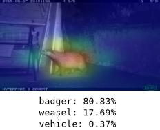
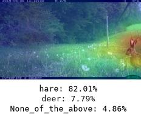
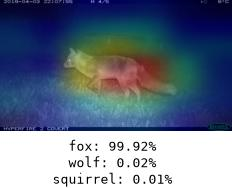

# Camera-Traps-Wild-Life

[](https://github.com/pietro-foini/camera-traps-wild-life/releases)
[](https://app-camera-traps-wildlife-latest.onrender.com/)

Hello there! 😀

This project was born from the idea of applying such algorithms to camera traps located on my family’s property in a 
remote area of Italy, where wildlife is frequently observed. The goal was to develop a simple application for fixed 
camera trap systems, where a basic motion detection algorithm could automatically identify subjects to be analyzed 
by a fine-tuned machine learning model for image classification.

Example of results applied to generic camera traps (used only for inference purposes):

<table width="100%" align="center">
  <tr>
    <td align="center" width="33%">
      <video src="https://github.com/user-attachments/assets/f903c4a7-a3cb-48b9-8807-4d2c9d73d5d4" width="100%" muted autoplay loop></video>
    </td>
    <td align="center" width="33%">
      <video src="https://github.com/user-attachments/assets/4f40051a-4307-4f2d-987a-77a2167c8220" width="100%" muted autoplay loop></video>
    </td>
    <td align="center" width="33%">
      <video src="https://github.com/user-attachments/assets/7968e2a3-fbf9-4bf2-966d-ab31f4e82518" width="100%" muted autoplay loop></video>
    </td>
  </tr>
</table>

Using Grad-CAM, we achieve model explainability to observe where the model focuses to reach its conclusions:

<p align="center">
  
  
  
</p>

<p align="center">
  <em>These images were retrieved from the <a href="https://emammal.si.edu/">eMammals</a> website in reference to the Tierschnappschuss Project based on camera trap locations in Italy.</em>
</p>

## Installation

This project requires Python 3.11 or 3.12 and relies on Poetry for dependency management. The project is structured to 
support three distinct installation modes depending on your hardware and requirements.

### Lite Setup

This setup is designed for edge deployments or lightweight servers where inference is handled exclusively via TensorFlow 
Lite models, resulting in a significantly smaller storage footprint.

```bash
poetry install --only main
```

### GPU Setup

This setup is designed for development, training, or production inference on machines equipped with NVIDIA GPUs.

```bash
poetry install --extras gpu
```

### CPU Setup

Because pip and Poetry do not natively allow conditional hardware-based resolution in a single configuration block, 
the CPU and GPU dependencies are mutually exclusive. You must manually modify the `pyproject.toml` file to switch from GPU to CPU.

After changing `pyproject.toml`, regenerate the lock file:

```bash
poetry lock
```

Finally, install the CPU dependencies with:

```bash
poetry install --extras cpu
```

## Usage

### Local Setup

1. Before starting the application, download the required pre-trained model weights from the [GitHub Releases](https://github.com/pietro-foini/Camera-traps-wild-life/releases) page of this repository:
   
   - **Object Detection:** MegaDetector v1000 model weights.
   - **Classification:** Fine-tuned ConvNeXtBase model weights.

2. Create an environment file defining your local model file paths and application settings (refer to [`settings.py`](./camera_traps/settings.py) for reference).

3. Ensure a **PostgreSQL** database instance is running to record image metadata and model predictions.

4. Start the application server:

   ```bash
   uvicorn camera_traps.main:app --env-file /path/to/your/local/env --reload
   ```
  
### Docker Setup

Run the entire pipeline with a single command:

```bash
docker compose --env-file /path/to/your/local/env up --build
```

Note on Model Volumes: By default, Docker Compose mounts ./models to /app/models. If your model files are stored in a 
different host path, override the `MODELS_DIR` environment variable:

```bash
ENV_FILE=/path/to/your/local/env MODELS_DIR=/path/to/your/local/models docker compose --env-file /path/to/your/local/env up --build
```

The app will be available at http://localhost:8000.

-----

## Model

The inference pipeline consists of three stages:

- **Object Detection:** `MegaDetector` is employed to detect animals, humans, and vehicles in camera trap images, filtering out empty frames or background noise.
- **Classification:** Detected cropped regions are processed by a fine-tuned `ConvNeXtBase` model trained to identify specific wildlife species.
- **Tracking:** Uses a `SORTTracker` to maintain object identities across video frames and applies label smoothing to stabilize predictions along tracked trajectories.

Training and fine-tuning were executed on an NVIDIA GeForce RTX 5060 Laptop GPU.

## Dataset

The current dataset was assembled by combining multiple online data sources to gather camera trap images captured in both 
daytime and nighttime settings. Subsequently, all images were manually reviewed to filter out noisy, misleading, or 
poorly identifiable samples, ensuring higher dataset quality. The data was collected over several years; therefore, we 
cannot guarantee that the provided links remain active or publicly accessible.

Images smaller than $100 \times 100$ pixels are filtered out to prevent low-quality samples from degrading model performance. 
After filtering, the final dataset consists of approximately 74,227 images distributed across day and night captures:

| label             | setting | count |
|-------------------|---------|-------|
| None_of_the_above | day     | 3798  |
| None_of_the_above | night   | 637   |
| badger            | day     | 870   |
| badger            | night   | 1353  |
| bear              | day     | 3308  |
| bear              | night   | 1311  |
| bird              | day     | 1853  |
| bird              | night   | 464   |
| boar              | day     | 3460  |
| boar              | night   | 2395  |
| cat               | day     | 2970  |
| cat               | night   | 4653  |
| cow               | day     | 4162  |
| cow               | night   | 590   |
| deer              | day     | 5180  |
| deer              | night   | 3545  |
| dog               | day     | 7285  |
| dog               | night   | 957   |
| fox               | day     | 1200  |
| fox               | night   | 2121  |
| hare              | day     | 1722  |
| hare              | night   | 2724  |
| human             | day     | 4671  |
| human             | night   | 161   |
| squirrel          | day     | 2570  |
| squirrel          | night   | 127   |
| vehicle           | day     | 2592  |
| vehicle           | night   | 47    |
| weasel            | day     | 2731  |
| weasel            | night   | 1634  |
| wolf              | day     | 1768  |
| wolf              | night   | 1368  |

The dataset folder structure is then organized as follows:

    root
     └── dataset
          ├── label1
          │   ├─ image1.jpg
          │   ├─ image2.png                              
          │   └─ ...
          └── label2
              └── ...

The filename of each image is defined as follows:

    {referenceNameDataset}_{nameLabel}_{timeCondition}_{progressiveIndex}.jpg

List of sources:

- NTLNP: https://paperswithcode.com/dataset/ntlnp-wildlife-image-dataset
- CCT20: https://lila.science/datasets/caltech-camera-traps
- Sheffield: https://figshare.shef.ac.uk/articles/dataset/Badger_datasets_for_image_recognition/8182370/1
- ENA24: https://lila.science/datasets/ena24detection
- LilaMissouri: https://lila.science/datasets/missouricameratraps
- WCS: https://lila.science/datasets/wcscameratraps
- PennFudan: https://www.cis.upenn.edu/~jshi/ped_html/
- yybbdog: https://www.lirmm.fr/YT-BB-Dog_Sibetan/
- nz: https://lila.science/datasets/nz-trailcams
- idaho: https://lila.science/datasets/idaho-camera-traps/
- felidae: https://lila.science/datasets/felidae-conservation-fund
- island: https://lila.science/datasets/channel-islands-camera-traps/
- seattleish: https://lila.science/datasets/seattleish-camera-traps/
- nkhotakota: https://lila.science/datasets/nkhotakota-camera-traps/
- roboflow: https://roboflow.com/
- oregon: https://lila.science/datasets/oregon-critters/
- maasai: https://lila.science/datasets/biome-health-project-maasai-mara
- UKCEH: https://catalogue.ceh.ac.uk/documents/bf82cec2-5f8a-407c-bf74-f8689ca35e83
- MOF: https://github.com/umr-ds/Mammal-Bird-Camera-Trap-Recognition/blob/main/data/data_download.sh
- BNP: https://github.com/umr-ds/Mammal-Bird-Camera-Trap-Recognition/blob/main/data/data_download.sh

## License

MIT

## Contacts

If you would like to request access to the pre-trained model weights, the curated dataset, or if you have any questions 
regarding the project, feel free to get in touch.

Email: pietro.foini1@gmail.com
